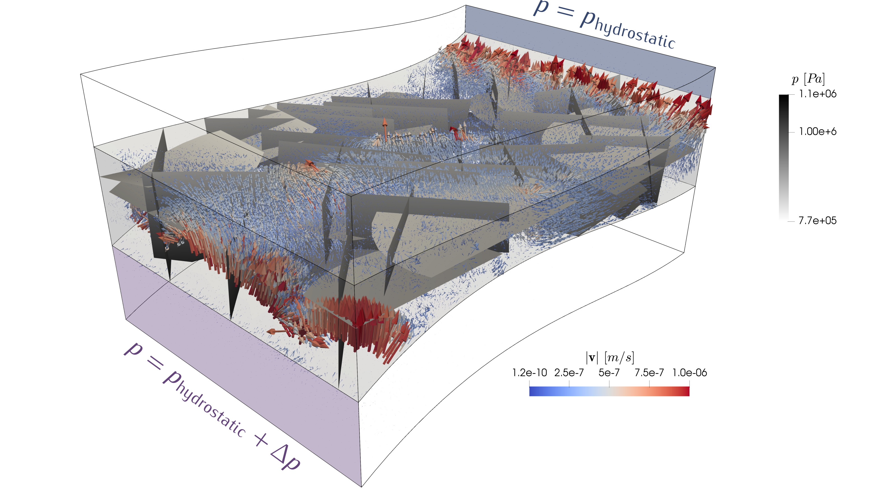

<!--- Example picture --->
<p align="center">
    
</p>

What is Frackit?
================

Frackit is an open-source framework for the stochastic generation of fracture networks.
The implementation is written in C++ language and extensively uses [OpenCASCADE][2],
an open-source Computer Aided Design (CAD) library. Moreover, Python bindings are available
that allow for using almost all of the functionality of Frackit from Python.

The geometric data generated by Frackit can be exported into a number of standard CAD
file formats supported by [OpenCASCADE][2]. This allows for visualization with a
variety of tools, as for example the [CAD Assistant][3] developed by [OpenCASCADE][2],
or [Gmsh][1], a three-dimensional finite element mesh generator.

Coupling to [DuMuX][0]
======================

Frackit features output routines to [Gmsh][1] file format (.geo), where in addition
to the geometric data, mesh size specifications can be defined upon fracture network
generation. This allows for the generation of computational meshes using [Gmsh][1],
which are supported, among other simulators, by the open-source simulator [DuMuX][0]
for flow and transport in porous media. The .geo files produced by Frackit, when
meshed with [Gmsh][1], lead to mesh files that contain the three-dimensional elements
that discretize the domain, two-dimensional elements that discretize the fractures,
and one-dimensional elements that discretize the intersections of fractures. The
meshes are conforming in the sense that higher-dimensional elements follow the
lower-dimensional features by aligning the element faces with the lower-dimensional
geometries.

This type of mesh format is supported by the [DuMuX][0] module for discrete
fracture-matrix simulations of single- and two-phase flow
(see e.g. <cite>Koch et al. (2019)</cite>, <cite>Gläser et al. (2019)</cite>, <cite>Gläser et al (2017)</cite>).
Thus, you can use Frackit in a toolchain with [Gmsh][1] and
[DuMuX][0] to perform simulations on the generated fracture networks.

The following picture shows an exemplary result for a single-phase simulation
on the fracture network shown above, and it depicts the pressure distribution
on the fractures as well as the fluid velocities in the domain:

<p align="center">
    
</p>

The source code to the flow simulation shown in the above figure, including installation
instructions, can be found [here][13]. Furthermore, [Example 3][4] of the Frackit examples
contains the code to generating a fracture network on the above domain geometry.

General Concept
===============

### Geometry Sampling
The generation of the fracture networks occurs by randomly sampling instances of the
desired fracture geometry on the basis of probability distributions, which
can be defined by the user. The implementation allows for both selecting the type of
distribution (uniform, exponential, etc.) as well as the distribution parameters.

### Constraints Evaluation
After the generation of a new candidate for a fracture entity, a number of constraints can
be evaluated for it. These can be used to enforce topological characteristics of the
fracture network, e.g. fracture spacing, by defining a minimum distance between entities.
Other constraints are targeted mainly at guaranteeing certain mesh properties by avoiding
very small length scales, and thus, small elements in the computational mesh. As constraints
one can define a minimum length scale of the intersections between fracture entities, a
minimum intersection angle, and a minimum distance of the intersection geometry to the boundary
of the intersecting entities. If the user-defined constraints are not fulfilled, the candidate
is rejected.

### Fragmentation of the network
After the desired number of fracture entities have been generated, an __EntityNetwork__
can be constructed from the raw entities. This intersects and fragments all entities, and
if desired, one can confine the network to a domain of choice.

Note that none of these steps are mandatory and there is no fixed and prescribed
program flow. Instead, users are motivated to implement their own applications
using the provided functions, classes and concepts. The modular design of the
above-mentioned building blocks enables users to fully customize each step to
their needs. Three exemplary applications are contained in this repository:

* [Example 1][5] Generation of a simple network consisting of quadrilaterals with two main orientations.
* [Example 2][6] Generation of a network of quadrilaterals embedded in a cylindrical domain (mimicking a core sample).
* [Example 3][4] Generation of a network consisting of both disks and quadrilaterals, confined and contained in one layer of a domain that is composed of three layers.


Documentation
=============

A class documentation can be generated from the source code using
[Doxygen][8] (see Installation notes).
Moreover, the [examples][7] contained in this repository provide a good overview over
the capabilities of Frackit and can serve as a starting point to develop your own
application. While the example descriptions focus on the implementation in C++, Python
implementations for all examples are also available in the respective example folders.


Installation
============

Please note that the following requirements need to be installed:

* OpenCASCADE (>= 7.3.0) (Note: Testing occurs with 7.3.0, no guarantee to work with higher versions)
* CMake (>3.0)
* C, C++ compiler (C++17 required)
* Optional: Doxygen (>= 1.8)
* Optional: python3 (for python bindings)
* Optional: pybind11 (for python bindings)

### Installation of OpenCASCADE
Frackit requires parts of the [OpenCASCADE][2] library to be installed on your system.
Thanks to the ["FreeCAD maintainers" team][15], there are Debian packages of
[OpenCASCADE][2] available (see [this link][14]). To install the required packages
on Ubuntu, you have to add the repository by typing

```sh
sudo add-apt-repository ppa:freecad-maintainers/occt-releases
sudo apt-get update
```

into the terminal. Then, you can install the packages with

```sh
sudo apt-get install libocct-modeling-algorithms-7.3 libocct-modeling-algorithms-dev libocct-foundation-7.3 libocct-foundation-dev libocct-modeling-data-7.3 libocct-modeling-data-dev
```

If you prefer building [OpenCASCADE][2] from the sources, you can download the
source code [HERE][2] after registration. For the version 7.3 release, you can
click [this link][16] to download the tarball without registration.
<!-- EDIT: PUBLIC ACCESS TO THE DEVELOPMENT PORTAL HAS BEEN STOPPED, MAYBE PUT
THE FOLLOWING PHRASE BACK IN IF THEY RE-OPEN IT!
, or get the tarballs from their
development portal at http://dev.opencascade.org. Click [this link][16] to download
the tarball for the version 7.3 release. -->
Details on building [OpenCASCADE][2]
can be found [HERE][10]. Please note that [OpenCASCADE][2] requires further 3rd
party products, which are listed [HERE][11].

<!-- On Debian-based distributions, all of these can be installed
from the command line via:

```sh
sudo apt-get install tcllib tklib tcl-dev tk-dev libfreetype-dev libxt-dev libxmu-dev libxi-dev libgl1-mesa-dev libglu1-mesa-dev libfreeimage-dev libtbb-dev libgl2ps-dev
``` -->

If you want to use the python bindings you need to install pybind11. You can get it from
the GitHub repository at [https://github.com/pybind/pybind11/][https://github.com/pybind/pybind11/]
and manually install it. Alternatively, you can install it via the command line (here shown for Ubuntu users)

```bash
sudo apt install pybind11-dev
```


### Building Frackit under Linux
After [OpenCASCADE][2] and the other requirements listed above have been installed,
clone this repository within your folder of choice by typing:

```sh
git clone https://git.iws.uni-stuttgart.de/tools/frackit.git
```

Then, create the build directory in which you want to compile the applications
and run cmake from it. For instance:

```sh
mkdir build
cd build
cmake ../
```

If cmake cannot find your installation of [OpenCASCADE][2], you probably installed it
into a non-standard location. In this case, you can define __HINTS__ for cmake to search
for it. In particular, you would have to change the line

```cmake
find_path(OCC_INC "Standard_Version.hxx" PATH_SUFFIXES opencascade include/opencascade)
```

to

```cmake
find_path(OCC_INC "Standard_Version.hxx" HINTS MY_OCC_INCLUDE_FOLDER)
```

in the _CMakeLists.txt_ file of the top folder of Frackit, substituting
MY_OCC_INCLUDE_FOLDER with the path to the source files of [OpenCASCADE][2]
on your system. The same has to be done for the required packages of
[OpenCASCADE][2], i.e. in the line

```cmake
find_library(OCC_LIB ${OCC}
             PATH_SUFFIXES lib ${OCC_SYS_NAME}/lib ${OCC_SYS_NAME}/vc8/lib)
```

you can define HINTS for cmake to find your installation folder of [OpenCASCADE][2].
Once cmake finished successfully, you could now compile the class documentation:

```sh
make doc_doxygen
```

and open it using a web browser, for example _chrome_:

```sh
google-chrome doc/doxygen/html/index.html
```

To build and run all unit tests, type

```sh
make build_tests
ctest
```

Moreover, you can build all example applications by typing

```sh
make build_example_applications
```

If this compiled successfully, you can go to the folder of the first example and
run it by typing:

```sh
cd appl/example1
./example1
```

To install the Frackit python package on your system, go back to the `build` folder and type

```sh
make
make install_python
```

If this finished successfully, you can, for instance, run the python implementation of
example1 by heading to the examples folder (in the source tree):

```sh
cd ../appl/example1
python3 example1.py
```


License
=======

Frackit is licensed under the terms and conditions of the GNU General
Public License (GPL) version 3 or - at your option - any later
version. The GPL can be [read online][9] or in the [LICENSE.md](LICENSE.md) file
provided in the top folder of Frackit. See the file [LICENSE.md](LICENSE.md) for
full copying permissions.


Contributing
=============

Contributions are highly appreciated.
For bug reports, please file an [issue](https://git.iws.uni-stuttgart.de/tools/frackit/issues).
If you want to contribute with new features or improvements of existing code, please

* Get an account for our GitLab instance at https://git.iws.uni-stuttgart.de/
* Fork this project
* Push your changes to your fork on some branch.
* Open a merge request using the branch you pushed your changes to as the source branch and the master
of the Frackit repository as the target branch.
* Follow the discussion on the merge request to see what improvements should be done to the branch
before merging.
* If you have developer status you don't need to do a fork and you can create branches directly.

In this project, we follow the [styleguide][2] of the [DuMuX][0] project.
Please have a look at this before you start coding your contributions.


Ongoing Developments
====================

* Extending the available functionality in the Python bindings
* Kernel for detailed characterizations of the generated fracture networks (e.g. connectivity, density, etc.)
* Capabilities for translation of fracture networks into graphs, allowing for efficient characterization of a network based on its graph representation.

References
====================

Koch, T., Gläser, D., Weishaupt, K., Ackermann, S., Beck, M., Becker, B., Flemisch, B. et al. (2019).<br>
_DuMuX 3 -- an open-source simulator for solving flow and transport problems in porous media with a focus
on model coupling._<br>
ArXiv E-Prints, 1909, arXiv:1909.05052

Gläser, D., Flemisch, B., Helmig, R., Class, H. (2019).<br>
_A hybrid-dimensional discrete fracture model for non-isothermal two-phase flow in fractured porous media._<br>
GEM - International Journal on Geomathematics, 10(1), 5.

Gläser, D., Helmig, R., Flemisch, B., Class, H. (2017).<br>
_A discrete fracture model for two-phase flow in fractured porous media._<br>
Advances in Water Resources, 110. doi:10.1016/j.advwatres.2017.10.031

[0]: https://dumux.org
[1]: http://gmsh.info/
[2]: https://www.opencascade.com/content/download-center
[3]: https://www.opencascade.com/content/cad-assistant
[4]: https://git.iws.uni-stuttgart.de/tools/frackit/tree/master/appl/example3
[5]: https://git.iws.uni-stuttgart.de/tools/frackit/tree/master/appl/example1
[6]: https://git.iws.uni-stuttgart.de/tools/frackit/tree/master/appl/example2
[7]: https://git.iws.uni-stuttgart.de/tools/frackit/tree/master/appl/
[8]: http://www.doxygen.org/index.html
[9]: https://www.gnu.org/licenses/gpl-3.0.en.html

[10]: https://www.opencascade.com/doc/occt-6.9.1/overview/html/occt_dev_guides__building_cmake.html
[11]: https://www.opencascade.com/doc/occt-6.9.1/overview/html/occt_dev_guides__building_3rdparty_linux.html
[12]: https://git.iws.uni-stuttgart.de/dumux-repositories/dumux/blob/master/doc/styleguide.md
[13]: https://git.iws.uni-stuttgart.de/dumux-pub/glaeser2020a
[14]: https://launchpad.net/~freecad-maintainers/+archive/ubuntu/occt-releases
[15]: https://www.freecadweb.org/
[16]: https://git.dev.opencascade.org/gitweb/?p=occt.git;a=snapshot;h=1630119c3a5ec5a3268ddf8775a7085b5f6b06de;sf=tgz
