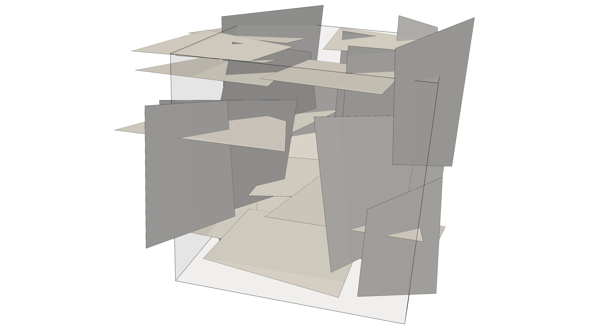

<!--- Example picture --->
<p align="center">
    
</p>

Example 1
=========

In this exemplary application, a network of quadrilateral fractures is generated
within the unit cube (see image above). The main file containing the source code
to this example is the file `example1.cc` which is located in this folder. Note
that this description focuses on the C++ implementation, but in `example1.py`
it is illustrated how to realize this example using the Frackit python bindings.

Two main orientations are considered for the quadrilaterals, for both of which
a corresponding instance of the `QuadrilateralSampler` class is created.
For example, we instantiate an instance of this class by writing:

```cpp
static constexpr int worldDimension = 3;

using ctype = double;
using Distro = std::normal_distribution<ctype>;
using QuadSampler = QuadrilateralSampler<worldDimension>;

Box<ctype> domain(0.0, 0.0, 0.0, 1.0, 1.0, 1.0);
QuadSampler quadSampler(makeUniformPointSampler(domain),         // point sampler that samples the center points of the quadrilaterals
                        Distro(toRadians(0.0), toRadians(5.0)),  // strike angle: mean value & standard deviation
                        Distro(toRadians(0.0), toRadians(5.0)),  // dip angle: mean value & standard deviation
                        Distro(0.5, 0.1),                        // edge length: mean value & standard deviation
                        0.05);                                   // threshold for minimum edge length
```

The first constructor argument is a point sampler with which the center points of
the quadrilaterals are sampled. Here we use uniformly sampled points in the unit
cube, which is represented by an instance of the `Box` class,  stored in the
variable `domain`. The second and third arguments define the distributions for
the strike and dip angle (for details see the [class documentation][2]), where in this case we use uniform distributions with
a mean value of 0° and a standard deviation of 5°. The fourth argument is the
distribution to be used for sampling the edge lengths, while the last argument
defines a minimum value below which the edge length must not fall.

In the example, the quadrilaterals are sampled from the two samplers `quadSampler1` and
`quadSampler2`, using the `()` operator:

```cpp
auto quad = sampleIntoSet1 ? quadSampler1() : quadSampler2();
```

Here, we use the boolean variable `sampleIntoSet1` to determine from
which sampler we should sample the next quadrilateral (more details follow below).
The variable `quad` holds a new candidate for an entity of the network, however,
we want to enforce certain constraints such as a minimum distance between
entities. For this we use instances of the `EntityNetworkConstraints` class and
configure it as desired. For example, the constraints on entities of the same
orientation are defined in this example as follows:

```cpp
// We want to enforce some constraints on the set of quadrilaterals.
// In particular, for entities of the same set we want a minimum spacing
// distance of 5cm, and the quadrilaterals must not intersect in angles
// less than 30°. Moreover, if they intersect, we don't want intersection
// edges whose length is smaller than 5cm, and, the intersection should not
// be too close to the boundary of one of two intersecting quadrilaterals. Here: 5cm.
EntityNetworkConstraints<ctype> constraintsOnSelf;
constraintsOnSelf.setMinDistance(0.05);
constraintsOnSelf.setMinIntersectingAngle(toRadians(30.0));
constraintsOnSelf.setMinIntersectionMagnitude(0.05);
constraintsOnSelf.setMinIntersectionDistance(0.05);
```

In the main loop of quadrilateral generation, the fulfilment of these constraints is
evaluated against the other quadrilaterals with:

```cpp
auto& entitySet = sampleIntoSet1 ? entitySet1 : entitySet2;
if (!constraintsOnSelf.evaluate(entitySet, quad))
{ status.increaseRejectedCounter(); continue; }
```

where `entityset1` and `entitySet2` are of type `std::vector<Quadrilateral>` and
store all quadrilaterals that are accepted. The function `evaluate` of the
`EntityNetworkConstraints` class evaluates the constraints for `quad` against all
entities contained in `entitySet` and returns `true` only if no violation of
any of the defined constraints has been found. After an admissible quadrilateral
has been generated, the line

```cpp
// sample into the other set the next time
sampleIntoSet1 = !sampleIntoSet1;
```

at the end of the loop makes sure that a quadrilateral of the other orientation
is sampled next. In [Example 3][0] we will get to know how to use helper classes
that store different entity sets and automatically sample from various sampler
classes such that this can be written more easily.

After the desired number of entities has been generated, the entities are cast
into an entity network using the builder class:

```cpp
EntityNetworkBuilder<ctype> builder;
builder.addEntities(entitySet1);
builder.addEntities(entitySet2);

const auto network = builder.build();
```

This network can then be written to disk, for example in [Gmsh][1] (.geo) file format:

```cpp
GmshWriter writer(network);
writer.write("network", // filename of the .geo files (will add extension .geo automatically)
             0.1);      // element size to be used
```

Note that with the `EntityNetworkBuilder` class we have created a network that
solely carries information about the fracture entities. We have not defined any
domain in this example, the unit cube in the variable `domain` was only used to
sample the center points of the quadrilaterals. Thus, the geometry files written
by the `GmshWriter` also only contain data on the fracture entities. This can be
used in contexts where one is only interested in the fractures. In the following
examples we will see how to construct fracture networks embedded in one or more
(sub-)domains.

[go to example 2][3]

[0]: https://git.iws.uni-stuttgart.de/DennisGlaeser/frackit/tree/master/appl/example3
[1]: http://gmsh.info/
[2]: https://git.iws.uni-stuttgart.de/DennisGlaeser/frackit/blob/master/frackit/sampling/quadrilateralsampler.hh
[3]: https://git.iws.uni-stuttgart.de/DennisGlaeser/frackit/tree/master/appl/example2
