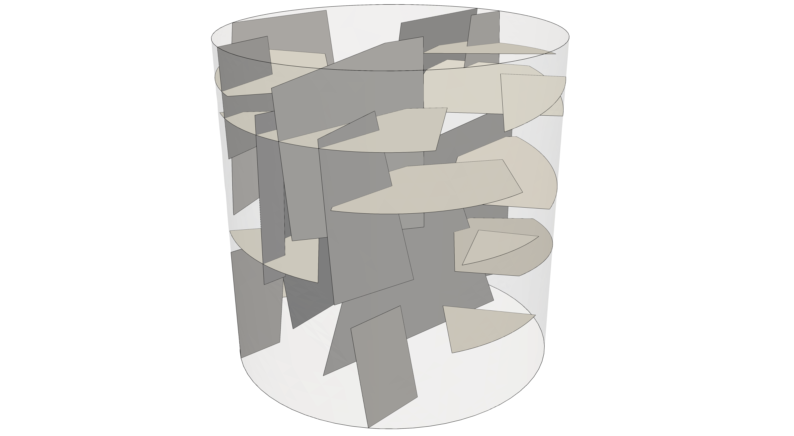
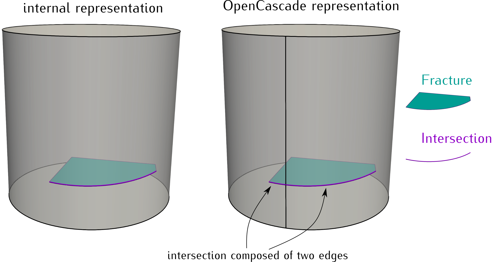
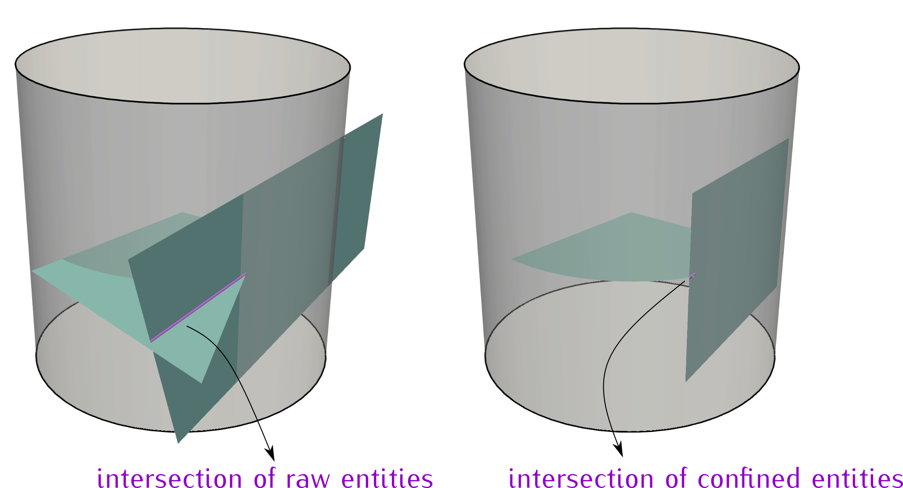

<!--- Example picture --->
<p align="center">
    
</p>

Example 2
=========

__Note that this description focuses on the c++ implementation given in the main
file `example2.cc`, but in `example2.py` it is illustrated how to realize this
example using the Frackit python bindings.__

In this exemplary application, a network of quadrilaterals, following the same
distributions as the network of [example 1][0], is created. However, in this
example we want to confine the network to a cylindrical domain (see image above).
We represent the domain via an instance of the internal cylinder class:

```cpp
// In this example we consider a cylindrical domain
Cylinder<ctype> domain(/*radius*/0.5, /*height*/1.0);
```

This creates an axis-aligned cylinder where the x- and y- axis form the basis of
the bottom face of the cylinder, while the cylinder axis is aligned with the
z-axis. Note that there are other ways to construct arbitrarily-oriented cylinders,
and for details on this we refer to the [class documentation][2].

In addition to constraints among entities of the different orientations, we also
want to enforce constraints with respect to the boundary of the cylindrical domain.
In this example, we simply reuse the constraints of entities of the same orientation
and write

```cpp
auto constraintsOnBoundary = constraintsOnSelf;
```

to create a new constraints object. We create this copy here to improve readability
of the code when evaluating the constraints. Within the loop in which the entities
are created, all constraints are enforced by writing:

```cpp
if (!constraintsOnSelf.evaluate(entitySet, quad))
{ status.increaseRejectedCounter(); continue; }

if (!constraintsOnOther.evaluate(otherEntitySet, quad))
{ status.increaseRejectedCounter(); continue; }

// we want to enforce constraints also w.r.t. to the cylinder boundary
if (!constraintsOnBoundary.evaluate(domain.topFace(), quad))
{ status.increaseRejectedCounter(); continue; }
if (!constraintsOnBoundary.evaluate(domain.bottomFace(), quad))
{ status.increaseRejectedCounter(); continue; }
if (!constraintsOnBoundary.evaluate(OCCUtilities::getShape(domain.lateralFace()), quad))
{ status.increaseRejectedCounter(); continue; }
```

In the first two if clauses, the constraints against other entities are checked, while
subsequently, the constraints against the boundary faces of the domain cylinder are evaluated.
As you can see, the constraints against the other entities are evaluated on the basis of the
raw entities. This can potentially fail to detect small length scales that appear after confining
the entities to the domain. A possibilty to address this and make the algorithm more robust (but
less efficient) is discussed at the end of this page.

As you can see in the above code snippet, the `Cylinder` class provides functions for obtaining th
representations of the top, bottom and lateral boundaries. The top and bottom boundaries are
represented by instances of the `Disk` class, while the lateral surface is described by the class
`CylinderSurface`. Please also note that for the lateral surface, we enforce the constraints
using its representation in OpenCascade, which we obtain by calling `OCCUtilities::getShape`.
We could also write `if (!constraintsOnBoundary.evaluate(domain.lateralFace(), quad)) {...}`,
but the behaviour is different. This is because in the OpenCascade representation of cylindrical
surfaces, there is an edge connecting the upper and lower circles. This has implications on the
constraint regarding the minimum allowed length of intersection edges, as these possibly
intersect with the edge of the cylindrical surface. The figure below illustrates the intersections
of a fracture quadrilateral with both the internal and the OpenCascade representations of cylindrical
surfaces.

<!--- Intersection with cylinder, internal vs OCC representation --->
<p align="center">
    
</p>

As you can see, when the internal representation of cylindrical surfaces is used, the result
is a single intersection edge, while this edge is split into two sub-edges in case the
OpenCascade representation is used. As a result, when evaluating the constraints against
the OpenCascade representation of the cylindrical surface, the constraint on the minimum
allowed length of intersection edges is checked for each sub-edge. Thus, this approach should
be preferred when using cylindrical domains in order to detect small length scales originating
from intersections with the auxiliary edge used by OpenCascade. This is important because
ultimately, when the network and the domain are fragmented and written into a CAD file, the
OpenCascade representation is used.

Moreover, we want to reject all those quadrilaterals of which only
a very small portion is inside the cylinder. This is done in the lines

```cpp
const auto containedArea = computeContainedMagnitude(quad, domain);

// reject if this is too small (< 0.01 m^2)
if (containedArea < 0.01)
{ status.increaseRejectedCounter(); continue; }
```

where `computeContainedMagnitude()` is a free function that returns the length/area/volume
of the part of a geometry that is contained inside of another geometry.

Finally, after the desired number of entities has been created, we cast the entities
into an instance of the class `ContainedEntityNetwork`, using the corresponding builder class:

```cpp
ContainedEntityNetworkBuilder<ctype> builder;

// define the domain (single sub-domain) and give it a unique id
builder.addConfiningSubDomain(domain, Id(1));
```

The class `ContainedEntityNetworkBuilder` returns an instance of a `ContainedEntityNetwork`
when the `build()` function is called (see below). This network implementation contains information
on sub-domains, and which entities are embedded in which sub-domain. Each sub-domain
receives a unique identifier by means of the `Id` class. By calling
`builder.addConfiningSubDomain(domain, Id(1))`, we define the sub-domain to be
confining, i.e. entities that are added to this sub-domain will be confined to it
by cutting away all parts that lie outside the sub-domain. In contrast to that,
one could call `builder.addSubDomain(domain, Id(1))`, in which case embedded networks
will not be confined (see [example 3][2]). Entities are associated with the sub-
domain they are embedded in, and are added to the builder class by writing

```cpp
// define entities to be embedded in this domain
builder.addSubDomainEntities(entitySet1, Id(1));
builder.addSubDomainEntities(entitySet2, Id(1));

const auto network = builder.build();
```

The variable `network` now holds an instance of the `ContainedEntityNetwork`,
which we can also pass to the `GmshWriter`:

```cpp
GmshWriter writer(network);
writer.write("network", // filename of the .geo files (will add extension .geo automatically)
             0.1,       // element size to be used on the quadrilaterals
             0.2);      // element size to be used in the domain away from the quadrilaterals
```

As you can see, one can specify different mesh sizes to be used on the fracture
entities and in the rest of the domain.

# Enforcing constraints on confined entities

As mentioned before, enforcing the constraints between the raw entities, small length
scales appearing after confining the entities to the domain are not detected. An
illustration of such a situation is depicted in the following figure:

<!--- Intersection of two quadrilateraly inside a cylinder, unconfined vs confined --->
<p align="center">
    
</p>

In such a case, the constraint on the minimum allowed length of intersection segments
might be fulfilled when checked on the raw entities, but might not be fulfilled on the
final geometry after confinement of all entities to the domain.
In order to overcome this, one can also evaluate the constraints on the confined entities,
thus, using the final geometry of an entity after its confinement. This could be achieved
by adjusting the part of the code of this example where the constraints are evaluated in the following way:

```cpp
auto quad = sampleIntoSet1 ? quadSampler1() : quadSampler2();
auto& entitySet = sampleIntoSet1 ? entitySet1 : entitySet2;
const auto& otherEntitySet = sampleIntoSet1 ? entitySet2 : entitySet1;

// get the face(s) that describe(s) the part of the entity that is contained in the domain
using namespace OCCUtilities;
const auto containedShape = cut(getShape(quad), getShape(domain), /*epsilon*/1e-6);
const auto containedFaces = getFaces(containedShape);

// check constraints for all faces making up the contained part
if (!constraintsOnSelf.evaluate(entitySet, containedFaces))
{ status.increaseRejectedCounter(); continue; }

if (!constraintsOnOther.evaluate(otherEntitySet, containedFaces))
{ status.increaseRejectedCounter(); continue; }
```

Note that the variable `containedFaces` is of type `std::vector<TopoDS_Face>`,
where `TopoDS_Face` is the OpenCascade type used to represent general two-dimensional
faces. In the above code snippets we have assumed `entitySet` and `otherEntitySet`
to also be of type `std::vector<TopoDS_Face>`, and to be composed of the previously
accepted faces.

[go to example 3][2]

[0]: https://git.iws.uni-stuttgart.de/DennisGlaeser/frackit/tree/master/appl/example1
[1]: https://git.iws.uni-stuttgart.de/DennisGlaeser/frackit/tree/master/geometry/cylinder.hh
[2]: https://git.iws.uni-stuttgart.de/DennisGlaeser/frackit/tree/master/appl/example3
