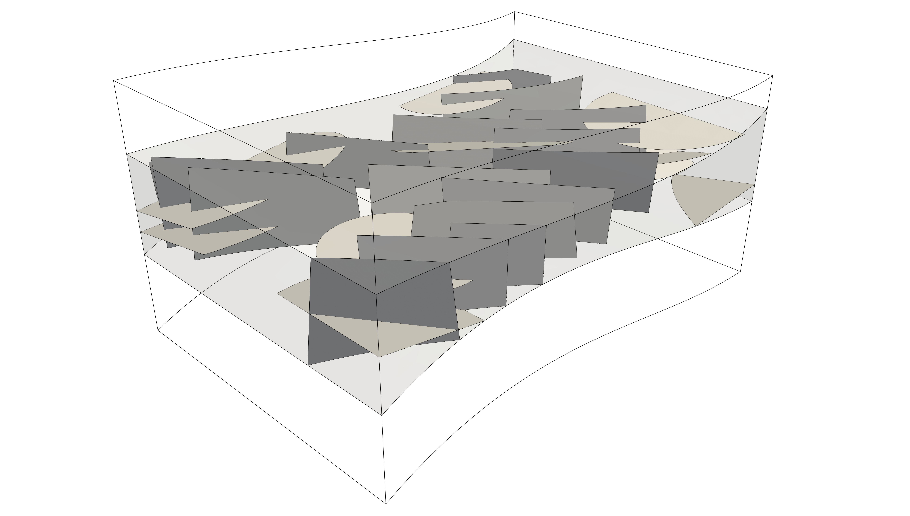

<!--- Example picture --->
<p align="center">
    
</p>

Example 3
=========

__As in the previous examples, this description focuses on the C++ implementation
given in the main file `example3.cc`, but in `example3.py` you can find how to
realize this example using the Frackit python bindings.__

<b> _In this example, you will learn how to:_ </b>

* read in a complex domain geometry from an CAD file
* get the bounding box of an arbitrary geometry
* use the `MultiGeometrySampler` and `MultiGeometryEntitySet` classes to conveniently compose a network out of multiple entity geometries
* use the `ConstraintsMatrix` class to conveniently define several constraints to be fulfilled among different entity sets
* define multiple confining/non-confining sub-domains to place the entities in

### Read in a domain geometry

In contrast to the [previous example][0], we now want to create a network within
a complex domain that cannot be represented by the internal geometry classes.
The domain has been created with [Gmsh][1] and has been saved in .brep file format.
In a first step, we need to read the file and parse it into an instance of the
`TopoDS_Shape` class of [OpenCascade][2]. To this end, we use the utility function
provided by Frackit in the namespace OCCUtilities:

```cpp
const auto domainShape = OCCUtilities::readShape(BREPFILE);
```

BREPFILE is a preprocessor variable that is substituted by cmake with the actual
path to the .brep file used for this test (see the file `CMakeLists.txt` in this folder).
The domain specified in the .brep file consists of three layers (see above image),
and here we want to construct an entity network only in the center one. The variable
`domainShape` contains the information of all layers, and we can use the utility
function

```cpp
const auto solids = OCCUtilities::getSolids(domainShape);
```

to extract the three layers, represented by instances of the `TopoDS_Solid` class
of [OpenCascade][2]. Note that the function `getSolids()` returns an instance of
`std::vector<TopoDS_Solid>`, and thus, we obtain the middle layer with

```cpp
const auto& networkDomain = solids[1];
```

Note that this requires knowledge about the ordering of the solids in the .brep file.

### Define entity samplers

As in the previous examples, we need a point sampler that samples the points to be
used as the center points of the fracture entities. In this example, we again want to
uniformly sample the points within a box, for which we use the bounding box of
`networkDomain`. This can be obtained using the utility function:

```cpp
const auto domainBBox = OCCUtilities::getBoundingBox(networkDomain);
```

With this, we create a quadrilateral sampler in a similar way as in the previous examples

```cpp
// we use the default sampler types, thus, default distributions (see traits classes)
using NormalDistro = std::normal_distribution<ctype>;
using UniformDistro = std::uniform_real_distribution<ctype>;

QuadrilateralSampler<3> quadSampler(makeUniformPointSampler(domainBBox),           // sampler for quadrilateral center points
                                    NormalDistro(toRadians(45.0), toRadians(5.0)), // strike angle: mean value & standard deviation
                                    NormalDistro(toRadians(90.0), toRadians(5.0)), // dip angle: mean value & standard deviation
                                    UniformDistro(30.0, 60.0),                     // strike length
                                    UniformDistro(30.0, 60.0));                    // dip length
```

For the entities of the other orientation, we want to use `Disk` objects in this case.
The instantiation of the corrensponding sampler class looks like this:

```cpp
DiskSampler diskSampler(makeUniformPointSampler(domainBBox),           // sampler for disk center points
                        NormalDistro(30.0, 6.5),                       // major axis length: mean value & standard deviation
                        NormalDistro(24.0, 4.5),                       // minor axis length: mean value & standard deviation
                        NormalDistro(toRadians(0.0), toRadians(7.5)),  // rotation around x-axis: mean value & standard deviation
                        NormalDistro(toRadians(0.0), toRadians(7.5)),  // rotation around y-axis: mean value & standard deviation
                        NormalDistro(toRadians(0.0), toRadians(7.5))); // rotation around z-axis: mean value & standard deviation

```

Here, the second and third constructor arguments specify the distributions used
for the major and minor axis lengths of the elliptical disks. The last three
constructor arguments specify the distributions used to determine the orientation
of the disks (for details we refer to the [class documentation][3]).

We use the `MultiGeometrySampler` class to facilitate sampling from several sampler
classes with possibly varying geometry types. Arbitrary many samplers can be added to
this class, with the following syntax:

```cpp
// Define ids for the two entity sets
const Id diskSetId(1); // we give the set of orientation one, consisting of disks, the id 1
const Id quadSetId(2); // we give the set of orientation two, consisting of quadrilaterals, the id 2

using Disk = Disk<ctype>;
using Quad = Quadrilateral<ctype, 3>;

// Sampler that samples both geometry types (disks & quads)
// In this one can define an arbitrary number of samplers, each
// of which is associated with an entity set with a unique id
MultiGeometrySampler<Disk, Quad> multiSampler;
multiSampler.addGeometrySampler(diskSampler, diskSetId);
multiSampler.addGeometrySampler(quadSampler, quadSetId);
```

Each sampler is associated with a unique identifier and an error is thrown if one
tries to add a sampler with an identifier that is already taken. Sampling
occurs again by using the `()` operator, but, in this case it receives an instance
of `Id`, in which it will store the identifier of the sampler from which the
geometry has been generated. That is, the code

```cpp
Id id;
auto geom = multiSampler(id);
```

stores in `id` the identifier of the sampler from which `geom` was sampled
(in this case this is either `diskSetId` or `quadSetId`). Note that, per default,
a `SequentialSamplingStrategy` is used, which means that the provided ids are used
successively in the calls to the `()` operator. However, users can implement their
own strategies and pass them to the constructor of `MultiGeometrySampler`.
In the above code snippet, the variable `geom` holds an instance of an abstract
geometry class as the return type of the `()` operator of the `MultiGeometrySampler`
must be uniquely defined. However, instances of the abstract geometry class can be
cast back into the actual geometry (in this case `Disk` or `Quad`).

In this context, another useful class is the `MultiGeometryEntitySet`. It can
store arbitrarily many sets of entities of different types. These
types have to be provided as template arguments to the class. In this example,
we use `Quadrilateral`s and `Disk`s, and therefore, we construct the class as follows:

```cpp
MultiGeometryEntitySet<Disk, Quad> entitySets;
```

Entities are again added by passing a unique identifier, that is, the code

```cpp
Disk disk = diskSampler();
entitySets.addEntity(disk, diskSetId);
```

adds a disk to an entity set with the identifier `diskSetId`. A respective overload
for this function is also implemented for the abstract geometry class mentioned above.
Thus, the geometries sampled from the `MultiGeometrySampler` can directly be inserted
into the instance of `MultiGeometryEntitySet`:

```cpp
Id id;
auto geom = multiSampler(id);
entitySets.addEntity(geom, id);
```

This allows the generation and storage of multiple geometry types and multiple orientations
in a compact way.

### Constraints definitions

In the previous examples, the constraints for a new entity candidate were evaluated
manually against the previously admitted entities obtained from the different samplers.
This becomes increasingly cumbersome the more orientations are to be considered, especially
if individual constraints are chosen between entities obtained from different samplers.
In such cases, the `EntityNetworkConstraintsMatrix` class can be used to facilitate
the constraints evaluation. It can be used in conjunction with the `MultiGeometryEntitySet`
class and allows for the definition of an arbitrary number of constraints,
which are to be evaluated among entities of specific orientations. In this example, we
create three different instances of the `EntityNetworkConstraints` class, and add them
to the matrix with:

```cpp
EntityNetworkConstraintsMatrix<Constraints> constraintsMatrix;
constraintsMatrix.addConstraints(constraints1,                  // constraint instance
                                 IdPair(diskSetId, diskSetId)); // set between which to use these constraints

constraintsMatrix.addConstraints(constraints2,                  // constraint instance
                                 IdPair(quadSetId, quadSetId)); // set between which to use these constraints

constraintsMatrix.addConstraints(constraintsOnOther,              // constraint instance
                                 {IdPair(diskSetId, quadSetId),   // sets between which to use these constraints
                                  IdPair(quadSetId, diskSetId)}); // sets between which to use these constraints
```

The `IdPair` objects are used to tell the constraints matrix between entities of
which sets, identified by ids, the individual constraints must hold. The evaluation
of all constraints can then be written in one line:

```cpp
// enforce constraints w.r.t. to the other entities
if (!constraintsMatrix.evaluate(entitySets, geom, id))
{ status.increaseRejectedCounter(); continue; }
```

In this function call, `id` holds the identifier of the set for which the candidate
`geom` was sampled. Internally, the `EntityNetworkConstraintsMatrix` instance will
check `geom` against the other entity sets using all constraints that were defined for this identifier.
For instance, in this example a disk-shaped geometry sampled from
the sampler with id `diskSetId`, will be checked against all entities of the set with
id `diskSetId` using `constraints1` and against all entities of the set with id `quadSetId`
using `constraintsOnOther`.

### Network construction

After successful generation of the desired number of entities, we again want to
construct an entity network from the raw entities and write it out in [Gmsh][1]
file format. In a first step, we create an instance of the network builder
class for contained networks and define the sub-domains:

```cpp
ContainedEntityNetworkBuilder<ctype> builder;

// add sub-domains
builder.addConfiningSubDomain(solids[0],     Id(1));
builder.addConfiningSubDomain(networkDomain, Id(2));
builder.addConfiningSubDomain(solids[2],     Id(3));
```

We have given the identifier with index 2 to the (sub-)domain for which we have created
the entity network. Using the convenience function available in the `MultiGeometryEntitySet`
class, we can add all entities to the builder by writing

```cpp
entitySets.exportEntitySets(builder, Id(2));
```

where the second argument states the (sub-)domain for which the entities should
be added to the builder (see [example 2][0]). If `entitySets` holds entity sets
associated with multiple (sub-)domains, or, if only some of the entity sets should
be added to the builder, one can use:

```cpp
entitySets.exportEntitySets({diskSetId, quadSetId}, builder, Id(2));
```

With this call only the entities of those sets that are given in the list of ids
inside the brackets (`{}`) are exported. An entity network can then be built and
written out in the same manner as shown in the other examples. At the end of the
main file `example3.cc`, it is shown how different types of networks
(contained-confined, contained-unconfined, etc.) can be created from the raw entities.

| [:arrow_right: Go to example 4](https://git.iws.uni-stuttgart.de/tools/frackit/tree/master/appl/example4) |
|---:|

[0]: https://git.iws.uni-stuttgart.de/tools/frackit/tree/master/appl/example2/README.md
[1]: http://gmsh.info/
[2]: https://www.opencascade.com/content/download-center
[3]: https://git.iws.uni-stuttgart.de/tools/frackit/tree/master/frackit/sampling/disksampler.hh
