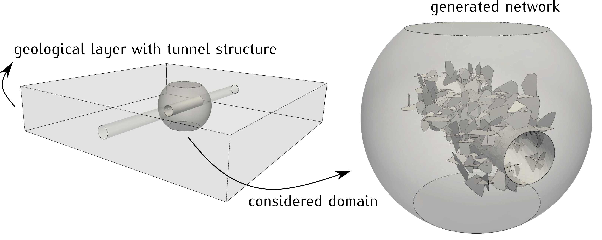

<!--- Example picture --->
<p align="center">
    
</p>

Example 4
=========

__As in the previous examples, this description focuses on the C++ implementation
given in the main file `example4.cc`, but in `example4.py` you can find how to
realize this example using the Frackit python bindings.__

<b> _In this example you will learn how to:_ </b>

* create a domain geometry by intersection/cut operations on basic geometry types
* generate random polygons using the `PolygonSampler` class
* design your own incremental network generation algorithm

Let us consider some idealized, hexahedral geological layer with an embedded
tunnel structure. The excavation of tunnels can have an effect on the stress
state in the surrounding rock and can lead to the generation of fractures, in
particular in the vicinity of the tunnels. This example aims at an illustration
of how such situations can modeled using `Frackit`.

### Step 1: domain generation

We want to focus on a spherical region around the center of the hexahedral
layer. To this end, we construct instances of the `Box` and `Sphere` classes
to represent these two geometries:

```cpp
// the layer has a thickness of 40m, and initially we consider 100m lateral extent
const Box layer(-50, -50, -20.0, 50, 50, 20.0);
const Sphere domainSphere(Point(0.0, 0.0, 0.0), /*radius*/25.0);

// a tunnel with a radius of 5m crosses the domain
const ctype tunnelRadius = 5.0;
const Direction tunnelDirection(Vector(1.0, 0.0, 0.0));
const Circle tunnelBase(Point(-25.0, 0.0, 0.0), tunnelDirection, tunnelRadius);
const Cylinder tunnel(tunnelBase, /*height*/50.0);
```

To construct the domain in which we want to place the entities of our network,
we use the `intersect` function in the `OCCUtilities` namespace to
compute the geometry of the volume that is the common part of `domainSphere` and `layer`.
The OpenCascade algorithms work on OpenCascade shapes, and therefore, we convert
the internal representations into shapes when passing them to the algorithm:

```cpp
const auto layerSphereCut = OCCUtilities::intersect(OCCUtilities::getShape(layer),
                                                    OCCUtilities::getShape(domainSphere),
                                                    /*eps*/1e-6);
auto solids = OCCUtilities::getSolids(layerSphereCut);
if (solids.size() != 1) throw std::runtime_error("Intersection operation with domainSphere should yield a single solid");
```

The result of `intersect` is a generic shape object. However, here we know that the
result is a single three-dimensional volume, and thus, we obtain the solid shapes
of the intersection result, of which we know there should only be a single one.
The function `getSolids` returns a vector of all solids contained in a shape, and
here we check if the result contains a single one, as is expected. Subsequently,
we cut the tunnel out of the intersection result (with the `cut` function in the
`OCCUtilities` namespace) in order to obtain the actual model domain:

```cpp
const auto tunnelCut = OCCUtilities::cut(solids[0], OCCUtilities::getShape(tunnel), /*eps*/1e-6);
solids = OCCUtilities::getSolids(tunnelCut);
if (solids.size() != 1) throw std::runtime_error("Cut operation with tunnel should yield a single solid");

// get the domain shape
const auto& domain = solids[0];
```

## Step 2: entity sampler definitions

Instead of randomly sample entities within the domain volume, in this example we
want to use a different approach. Here, the goal is to generate a network in the
vicinity of the tunnel. To this end, we use a three-stage algorithm to construct
the network, where in each stage we generate entities of a different orientation.
We use polygonal entities, and at this point we define a convenience lambda that,
provided a point sampler, returns an instance of `PolygonSampler` of the given
orientation:

```cpp
// we use the default sampler types, thus, default distributions (see traits classes)
// This means, normal distributions for angles and uniform distributions for the size
using PolygonSampler = Frackit::PolygonSampler</*spaceDimension*/3, ctype>;

// lambda function to construct polygon sampler with given point sampler & orientation
auto getSampler = [] (const auto& pointSampler, unsigned int orientation) -> PolygonSampler
{
    using NormalDistro = std::normal_distribution<ctype>;
    auto sizeDistro = std::uniform_real_distribution<ctype>(3.0, 6.0);
    auto numCornerDistro = std::uniform_int_distribution<int>(4, 9);

    switch (orientation)
    {
        case 1:
            return PolygonSampler(pointSampler,                                   // sampler for polygon centers
                                  NormalDistro(toRadians(15.0), toRadians(10.0)), // strike angle: mean value & standard deviation
                                  NormalDistro(toRadians(90.0), toRadians(10.0)), // dip angle: mean value & standard deviation
                                  /*strikeLength/*/sizeDistro, /*dipLength*/sizeDistro, numCornerDistro);
        case 2:
            return PolygonSampler(pointSampler,                                  // sampler for polygon centers
                                  NormalDistro(toRadians(0.0), toRadians(10.0)), // strike angle: mean value & standard deviation
                                  NormalDistro(toRadians(0.0), toRadians(10.0)), // dip angle: mean value & standard deviation
                                  /*strikeLength/*/sizeDistro, /*dipLength*/sizeDistro, numCornerDistro);
        case 3:
            return PolygonSampler(pointSampler,                                    // sampler for polygon centers
                                  NormalDistro(toRadians(-75.0), toRadians(10.0)), // strike angle: mean value & standard deviation
                                  NormalDistro(toRadians(90.0), toRadians(10.0)),  // dip angle: mean value & standard deviation
                                  /*strikeLength/*/sizeDistro, /*dipLength*/sizeDistro, numCornerDistro);
        default:
            throw std::runtime_error("Unsupported orientation index");
    }
};
```

As can be seen, an instance of the `PolygonSampler` class is constructed with
statistical distributions on the strike and dip angles (polygon orientations),
the size of the polygon in strike and dip direction (polygon sizes) and the
number of corners. We use the default distribution types here, which means
normal distributions for the orientation angles and uniform distributions for
the sizes and number of corners. As for the other samplers, one can choose
different distributions by implementing and passing a traits class as template
argument to `PolygonSampler`. For more details we refer to the corrensponding
[class documentation](https://git.iws.uni-stuttgart.de/tools/frackit/tree/master/frackit/sampling/polygonsampler.hh)

### Step 3: constraints definitions

The first three examples already explained how to define and use the `Constraints`
class of `Frackit`. As in those examples, here we also use several instances of
that class to define constraints to be fulfilled between entities of different
orientations, or between entities and the domain boundary. For more details on
this, please look at the previous examples. Here, we want to focus on additional
custom constraints that we would like to be fulfilled. That is, we want to ensure
that the intersections between different entities do not produce very small length
scales on the polygon boundaries as a result of being very close to a polygon
corner. To this end, we define the following lambda function to be used during
network generation:

```cpp
// When polygons intersect, the intersection might be very close to
// one of the corner points. We want to avoid small length scales caused
// by this, and this lambda provides the check for it.
auto producesSmallLengthScale = [] (const auto& geometry, const auto& is) -> bool
{
    // lambda to check if the intersection is too close (< 1mm) to a vertex of the geometry
    auto isTooClose = [&is] (const auto& v) { return computeDistance(v, is) < 1e-3; };

    const auto shape = OCCUtilities::getShape(geometry);
    const auto vertices = OCCUtilities::getVertices(shape);
    return std::any_of(vertices.begin(), vertices.end(), isTooClose);
};
```

The lambda `producesSmallLengthScale` checks if the intersection `is` is less than
1 mm away from any of the vertices of the given geometry. Note that in this lambda
we again operate on shapes rather than the internal representation of polygons.
The reason for this is that the above implementation is more generic and works
for any given geometry type. In this example, it is called both with polygons
as well as OpenCascade shapes.

### Step 4: entity sampling

As mentioned before, here we want to construct the network in three stages:

* Stage 1: generate entities of orientation 1 close to the tunnel, each entity must intersect the tunnel
* Stage 2: for each entity `e1` of stage 1, generate an entity of orientation 2 that intersects `e1`
* Stage 3: for each entity `e2` of stage 2, generate an entity of orientation 3 that intersects `e2`

This ensures that all entities of the network are connected to at least one other,
and that the overall network remains in the vicinity of the tunnel.

__Stage 1__: In order to efficiently sample entities that intersect the tunnel,
we search for new candidates in a small region around it. Recall that our lambda
function `getSampler` expects a point sampler to be passed, which is used to sample
the spatial location of a new polygonal entity candidate. In this first stage,
we use a point sampler that uniformly samples points within a hollow cylinder
around the tunnel. This is done in following two lines of code.

```cpp
const HollowCylinder sampleCylinder1(tunnel.bottomFace().center(),
                                     tunnel.direction(),
                                     tunnel.radius(),       // inner radius
                                     tunnel.radius() + 2.0, // outer radius
                                     tunnel.height());
auto polygonSampler1 = getSampler(makeUniformPointSampler(sampleCylinder1), /*orientationIdx*/1);
```

Subsequently, `polygonSampler1` is used to get entity candidates until the desired
number of entities has been accepted, checking each entity against a number of
constraints. In particular, entities that do not intersect the tunnel are
rejected immediately.

__Stage 2__: For each entity `e` of stage 1, we want to generate an entity of orientation 2
that intersects `e`. Therefore, we loop over all entities of stage 1 and sample new
candidates in their vicinity. This is achieved by computing the bounding box of `e`,
which is then used to define a region in which new candidates are sampled:

```cpp
for (const auto& e : entitiesSet1)
{
    using std::sqrt;

    // sample an entity of orientation 2 in the vicinity of e
    const auto rawBBox = getBoundingBox(e);
    const auto charLength = sqrt(computeMagnitude(e)); // characteristic length of e
    const Box sampleBox(rawBBox.xMin()-charLength, rawBBox.yMin()-charLength, rawBBox.zMin()-charLength,
                        rawBBox.xMax()+charLength, rawBBox.yMax()+charLength, rawBBox.zMax()+charLength);

    auto sampler = getSampler(makeUniformPointSampler(sampleBox), /*orientationIdx*/2);
```

The variable `sampler` now holds an instance of the `PolygonSampler` class, which generates
polygons of orientation 2 within the box `sampleBox` that describes the vicinity of `e`.
We then sample candidates until we have found an entity that fulfills all desired constraints.
After that, it is continued with the next entity of `entitiesSet1` until all have been visited.


__Stage 3__: this stage follows the same logic as stage 2, but it samples entities of
orientation 3 and looks for entity candidates in the vicinity of the entities of stage 2:

```cpp
for (const auto& e : entitiesSet2)
{
    using std::sqrt;

    // sample an entity of orientation 2 in the vicinity of e
    const auto rawBBox = getBoundingBox(e);
    const auto charLength = sqrt(computeMagnitude(e));
    const Box sampleBox(rawBBox.xMin()-charLength, rawBBox.yMin()-charLength, rawBBox.zMin()-charLength,
                        rawBBox.xMax()+charLength, rawBBox.yMax()+charLength, rawBBox.zMax()+charLength);

    auto sampler = getSampler(makeUniformPointSampler(sampleBox), /*orientationIdx*/3);
```

Note that due to the restrictive constraints used in this example, the entity
generation step can take up to a few minutes.

### Step 5: network generation

As in the previous example, we use the `ContainedEntityNetworkBuilder` class
to construct the network and embed it in our domain:

```cpp
// construct and write a contained network, i.e. write out both network and domain.
std::cout << "Building and writing network" << std::endl;
ContainedEntityNetworkBuilder<ctype> builder;

// add sub-domains
builder.addConfiningSubDomain(domain,     Id(1));
builder.addSubDomainEntities(entitiesSet1, Id(1));
builder.addSubDomainEntities(entitiesSet2, Id(1));
builder.addSubDomainEntities(entitiesSet3, Id(1));
```

Here, we give the domain the `Id` "1" and define all entities to be embedded within it.
The following lines of code then perform the actual construction of the network
in the call `builer.build()`, and write out both the network and the domain to
Gmsh file format:

```cpp
// now we can build and write out the network in Gmsh file format
GmshWriter gmshWriter(builder.build());
gmshWriter.write("network", /*sizeAtEntities*/0.5, /*sizeInDomain*/5.0);
```
