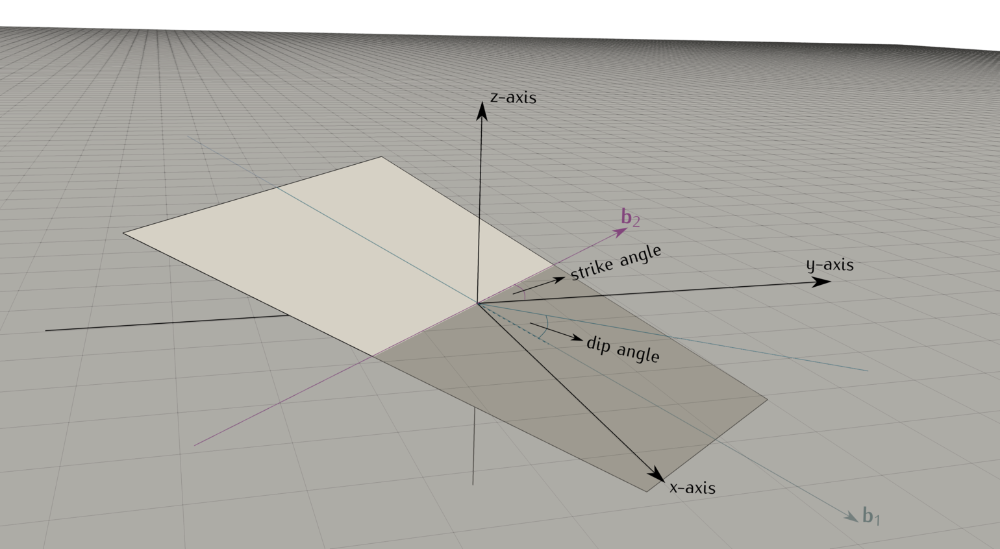

# Summary

``Frackit`` is a framework for the stochastic generation of fracture networks
composed of two-dimensional geometries, for instance, polygons and/or ellipses,
which can be embedded in arbitrary three-dimensional domain shapes.
Great flexibility with respect to the geometries that can be used is achieved
by extensive use of the open-source
Computer-Aided-Design (CAD) library [OpenCascade][4] ([opencascade.com][5]),
which furthermore provides the possibility to export the generated networks into
a variety of CAD file formats for subsequent post-processing or meshing
with other software. Besides that, output routines to the geometry file format
of Gmsh ([gmsh.info/](https://www.gmsh.info/); @gmsh2009) are provided,
which is an open-source mesh generator that is widely used in academic research
on numerical methods (see e.g. @keilegavlen2020porepy; @berge2019).
The code is written in C++, but Python
bindings are provided that allow users to access all functionality from Python.

# Introduction

The numerical simulation of flow and transport phenomena in fractured porous media
is an active field of research, given the importance of fractures in many
geotechnical engineering applications, as for example groundwater management
[@qian2014], enhanced oil recovery techniques [@torabi2012],
geothermal energy [@mcfarland1976; @shaik2011] or unconventional
natural gas production [@sovacool2014]. A number of mathematical models and numerical
schemes, aiming at an accurate description of flow through fractured rock, have been
presented recently
(see e.g. @ahmed2015; @ahmed2017; @brenner2018; @koppel2019; @schadle2019; @nordbotten2019).
Many of these describe the fractures as lower-dimensional
geometries, that is, as curves or planes embedded in two- or three-dimensional
space, respectively. On those, integrated balance equations are solved together
with transmission conditions describing the interaction with the surrounding medium.
Moreover, many models require that the computational meshes used for the different
domains are conforming in the sense that the faces of the discretization used for
the bulk medium coincide with the discretization of the fractures (see \autoref{fig:grids}).


Information on the in-situ locations of fractures is typically sparse and
difficult to determine. As a response to this, a common approach is to study
the hydraulic properties of rock in function of the fracture network topology by means
of numerical simulations performed on stochastically generated fracture networks.
Such investigations have been presented, among many others, in
@Kazumasa2003; @Assteerawatt2008; @lee2015fracture; @zhang2015finite; @lee2019stochastic.
An overview over several other works in which stochastically generated fracture
networks have been used can be found in @LEI2017.

In many such studies, the researchers have used self-developed codes for the
stochastic generation of the fracture networks, but unfortunately, in most cases the
code is not publicly available. Two examples for open-source software packages are
@hyman2015dfnWorks and @alghalandis2017, both of which contain functionality
related to network generation and analysis, while the former additionally provides
meshing and simulation capabilities to simulate flow and transport on the generated
networks. An example for a commercial
software package is FracMan ([golder.com/fracman](https://www.golder.com/fracman/)),
while DFN.LAB ([fractorylab.org](https://fractorylab.org/)) is a non-open-source
research code, to which access is only granted to research collaborators of the
development team.

# Statement of need

In the context of simulation-based research on fractured media, stochastically
generated fracture networks are useful in applications where field data is sparse or
unavailable, where the impact of different network patterns is studied, or when the
performance of a numerical scheme is to be investigated on networks that exhibit
certain properties. However, when the simulations are carried out with grid-based
numerical schemes, the mesh quality is of particular importance and should be
taken into account already during the network generation. In particular, small length
scales and angles at intersecting geometries should be avoided,
as well as small distances due to fractures being very close to each other or to the
domain boundary. Within the above-mentioned non-commercial packages,
such a feature (without the check for small angles) is only available
in @hyman2015dfnWorks. They describe fractures by polygons, which are also
used to approximate elliptical shapes, and the domains are restricted
to hexahedra. In ``Frackit``, such checks can be performed between arbitrary, possibly
non-linear geometries, for instance, between elliptical disks and cylinder surfaces,
and there is no need to represent geometries by linear approximations.
This enables users to mesh the resulting geometries with the desired resolution
without artifacts from the discretization (approximation) of the geometries themselves.

Generators often work with input files for setting a large number of parameters of the
network generation, or provide a single generator class with parameter setter functions,
in which the entire network generation process occurs. While this
enables new users to obtain results quickly and
with less effort, this might also limit the possibilities for customization of the
generation algorithm. In contrast to that, ``Frackit`` is structured in a modular
way, allowing users to pick the functionalities they need to assemble custom
network generation algorithms. The modular design also facilitates the incorporation
of new features without having to modify existing classes or functions.
Moreover, the generated networks can be exported into a
variety of output file formats for subsequent post-processing, meshing and simulation
with other software. If desired, the geometric data produced by ``Frackit`` contains
the complete fragmentation
of all geometric entities involved, i.e. the intersection geometries between
all entities are computed. Thus, this information can be directly used in the
context of discrete fracture-matrix (dfm) simulations in a conforming way as
described before. For instance, the open-source simulator
[DuMuX][3] [@Dumux; @Kochetal2020Dumux; [dumux.org][3]]
contains a module for conforming dfm simulations of single- and multi-phase
flow through fractured porous media, which has been used in several works
[@glaeser2017; @glaeser2019; @andrianov2019].
It supports the [Gmsh][2] file format, and thus, ``Frackit`` can be used in
a fully open-source toolchain with [Gmsh][2] and [DuMuX][3] to generate random
fracture networks, construct computational meshes, and perform analyses on them
by means of numerical simulations.

# Concept

The design of ``Frackit`` is such that there is no predefined program flow, but
instead, users should implement their own applications using the provided classes
and functions. This allows for full customization of each step of the network
generation. Furthermore, in the case of available measurement data, one could
skip the network generation process and use ``Frackit`` to compute the fragmentation
of the measured data and to generate CAD files for subsequent meshing. The code
is structured around three fundamental tasks involved in the generation of random
networks:

* Random generation of a new fracture entity candidate based on statistical
  parameters (and possibly information on previously generated entities)
* Evaluation of geometric constraints for a new entity candidate against
  previously generated entities or the domain boundary
* Fragmentation of the generated raw entities and the embedding domain

This paper focusses on the first two of the above-mentioned steps, and we refer
to the code documentation for details on further available functionalities.
The presented code snippets focus on the implementation in C++, and for details on
how to use ``Frackit`` from Python we refer to the examples provided in the repository
([git.iws.uni-stuttgart.de/tools/frackit][0]).

## Random generation of fracture entities

In the network generation procedure, a domain is populated with fracture entities
that are generated following user-defined statistical properties regarding their
size, orientation and spatial distribution. In ``Frackit``, this process is termed
_geometry sampling_ and is realized in the code in _sampler_ classes. In the current
implementation, there are three such sampler classes available, which sample
quadrilaterals, polygons and elliptical disks in three-dimensional space.
A sampler class of ``Frackit`` receives an instance of a `PointSampler`
implementation and a number of probability distributions that define the size and
orientation of the raw entities. `PointSampler` classes are used to sample the
spatial distribution of the geometries inside a domain geometry. For example, a
point sampler that samples points uniformly within the unit cube (defined in the
variable `domain`) could be constructed like this:

```cpp
// the type used for coordinates values
using ctype = double;

// define axis-aligned box in which to sample the centers points
using Domain = Frackit::Box<ctype>;
Domain domain(0.0, 0.0, 0.0,  // xmin, ymin, zmin
              1.0, 1.0, 1.0); // xmax, ymax, zmax

// let us uniformly sample points within this box
auto pointSampler = Frackit::makeUniformPointSampler(domain);
```

The convenience function `makeUniformPointSampler()` can be used for uniform
sampling over the provided domain geometry. For nun-uniform samplers, one can write

```cpp
auto pointSampler = Frackit::makePointSampler<Traits>(domain);
```

where in the `Traits` class users define the type of distribution to be used
for each coordinate direction. Inside a geometry sampler class, a geometry is
created by sampling a point from the point sampler, and then constructing an instance
of the desired geometry around this point using the provided distributions for its size and orientation. For example,
the `QuadrilateralSampler` class expects distributions for the strike and dip angles,
and for the lengths in strike and dip direction.
The following piece of code shows how an instance of the `QuadrilateralSampler`
class can be created, using normal distributions for all parameters regarding
orientation and uniform distributions for the lengths (we reuse the `pointSampler`
variable defined in the previous code snippet):

```cpp
// let us use uniform distributions for the quadrilateral parameters
using NormalDistro = std::normal_distribution<ctype>;
using UniformDistro = std::uniform_real_distribution<ctype>;

// Distributions for strike/dip angles & lengths
NormalDistro strikeAngleDistro(toRadians(45.0), // mean value
                               toRadians(5.0)); // standard deviation
NormalDistro dipAngleDistro(toRadians(45.0),    // mean value
                            toRadians(5.0));    // standard deviation
UniformDistro strikeLengthDistro(0.4, 0.6);     // min & max length
UniformDistro dipLengthDistro(0.4, 0.6);        // min & max length

// instance of the quadrilateral sampler class
using QuadSampler = Frackit::QuadrilateralSampler</*spaceDimension*/3>;
QuadSampler quadSampler(pointSampler,
                        strikeAngleDistro,
                        dipAngleDistro,
                        strikeLengthDistro,
                        dipLengthDistro);
```

As for point samplers, one can use different distributions by implementing
a `Traits` class which is then passed to the `QuadrilateralSampler` as template
argument. The definitions of the strike and dip angles as used within the
`QuadrilateralSampler` class are illustrated in \autoref{fig:quadSampler}. Consider a
quadrilateral whose center is the origin and which lies in the plane defined by
the two basis vectors $\mathbf{b}_1$ and $\mathbf{b}_2$. The latter lies in the
$x$-$y$-plane and the strike angle is the angle between the $y$-axis and $\mathbf{b}_2$.
The dip angle describes the angle between $\mathbf{b}_1$ and the $x$-$y$-plane.



In the code, random generation of geometries from sampler classes occurs by using
the `()` operator. For example, from the `quadSampler` variable defined in the
previous code snippet, we obtain a random quadrilateral by writing:

```cpp
// generate random quadrilateral
const auto quad = quadSampler();
```

## Evaluation of geometric constraints

While the domain is populated with the raw fracture entities, users have the
possibility to enforce geometric constraints between them in order for the network
to exhibit the desired topological characteristics such as, for instance, fracture spacing.
Furthermore, constraints can be used to avoid very small length scales that could cause problems
during mesh generation or could lead to ill-shaped elements. In the code, constraints
can be defined and evaluated using the `EntityNetworkConstraints` class. These have
to be fulfilled by a new fracture entity candidate against previously accepted
entities. If any of the defined constraints is violated, the candidate may be
rejected and a new one is sampled. The current implementation of the
`EntityNetworkConstraints` class allows users
to define a minimum distance between two entities that do not intersect. If two
entities intersect, one can choose to enforce a minimum length of the intersection
curve, a minimum intersection angle and a minimum distance between the intersection
curve and the boundaries of the intersecting entities. An illustration of such
situations is shown in \autoref{fig:constraints}.


Please note that internally, the `EntityNetworkConstraints` class uses geometry
algorithms that are part of the public interface of ``Frackit``. Thus, one can
easily develop custom constraints and enforce additional geometric constraints.
The following code snippet illustrates how to set up an instance of the
`EntityNetworkConstraints` class:

```cpp
// Instantiate constraints class. This leaves all constraints deactivated.
Frackit::EntityNetworkConstraints<ctype> constraints;

// Set values to activate constraints
constraints.setMinDistance(0.1);               // in meter
constraints.setMinIntersectingAngle(M_PI/4.0); // in radians
constraints.setMinIntersectionMagnitude(0.05); // in meter
constraints.setMinIntersectionDistance(0.05);  // in meter

// define geometric tolerance to be used for intersections
constraints.setIntersectionEpsilon(1e-6);
```

When using the default constructor of `EntityNetworkConstraints` all constraints
are inactive, and when defining values for the different constraint types, these
get activated internally. The last line in the above code snippet shows how to
define the geometric tolerance that should
be used in the intersection algorithms between entities. If no tolerance is set,
a default value is computed based on the size of the entities for which the
intersection is to be determined. For two quadrilaterals `quad1` and `quad2`, one
can then evaluate the defined constraints by writing:

```cpp
bool fulfilled = constraints.evaluate(quad1, quad2);
```

The function `evaluate()` returns true if all constraints are fulfilled. One can
also check the fulfillment of the constraints of a new candidate against an entire
set of entities. Let `quad` be a new candidate for a quadrilateral, and
`quadSet` be a vector of quadrilaterals (`std::vector< Quadrilateral<ctype> >`),
then one can write

```cpp
bool fulfilled = constraints.evaluate(quadSet, quad);
```

to evaluate the constraints between `quad` and all entities stored in `quadSet`.


# Example application

In the following we want to illustrate an exemplary workflow using
`Frackit` together with [Gmsh][2] and [DuMuX][3]. The images are
taken from the `Frackit` documentation ([git.iws.uni-stuttgart.de/tools/frackit][0])
and the configurations of the geometry samplers are, apart from small modifications,
very similar to the ones used in [example 3][1] provided in the `Frackit` repository.
For further details on how to set up such configurations we refer to the source code
and the documentation of that example in the repository. Note that this example is
not meant to represent a realistic fracture network, but should rather highlight the
flexibility of the code with respect to the geometries that can be used.

Let us consider a domain consisting of three solid layers of which we want to
generate a fracture network only in the center volume. The following piece
of code shows how to read in the domain geometry from a CAD file, extract
its three volumes and select the middle one as the subdomain in which to place
the fracture network (this assumes knowledge of the ordering of the volumes).

```cpp
/////////////////////////////////////////////////////
// 1. Read in the domain geometry from .brep file. //
//    The file name is defined in CMakeLists.txt   //
/////////////////////////////////////////////////////
const auto domainShape = Frackit::OCCUtilities::readShape(BREPFILE);

// obtain the three solids contained in the file
const auto solids = Frackit::OCCUtilities::getSolids(domainShape);

// The sub-domain we want to create a network in is the center one.
const auto& networkDomain = solids[1];

// get the bounding box of the domain
const auto bBox = Frackit::OCCUtilities::getBoundingBox(networkDomain);
```

The last command constructs the bounding box of the center volume of our domain,
which we can then use to instantiate point sampler classes that define
the spatial distribution of the fracture entities. With these, we can construct
geometry samplers as outlined above. In this example, we define three
geometry sampler instances to sample from three different orientations of fractures,
and we use quadrilaterals for two of the orientations and elliptical disks for
the third orientation. Moreover, we define different constraints that should be
fulfilled between the entities of different orientations. As mentioned above, details
on how to implement such settings can be found in [example 3][1] in the `Frackit` repository.

A number of fractures is then generated for each orientation. Subsequently, the
raw entities and the three volumes of the domain are cast into an instance
of the `ContainedEntityNetwork` class. This can be used to define arbitrarily many
(sub-)domains, and to insert entities to be embedded in a specific sub-domain.
The `ContainedEntityNetwork` computes and stores the fragments of all entities
and sub-domains resulting from mutual intersection. Output routines for instances
of this class are implemented, which generate geometry files that are ready to be
meshed using designated tools such as [Gmsh][2].

The image below illustrates the workflow chosen in this example, using ``Frackit``
to generate a random fracture network, [Gmsh][2] to mesh the resulting geometry,
and [DuMuX][3] to perform a single-phase flow simulation on the resulting mesh.
The bottom picture shows the pressure distribution on the fractures and the
velocities in the domain as computed with [DuMuX][3], using the illustrated
boundary conditions.


The source code of this example, including installation instructions, can be found
at https://git.iws.uni-stuttgart.de/dumux-pub/glaeser2020a.

# Future developments

We are planning to add fracture network characterization capabilities, such as
the detection of isolated clusters of fractures or the determination of connectivity
measures. In order to do this efficiently, we want to integrate data
structures and algorithms for graphs, together with functionalities to translate
the generated fracture networks into graph representations.


# Acknowledgements

We thank the German Research Foundation (Deutsche Forschungsgemeinschaft)
for supporting this work by funding SFB 1313, Project Number 327154368.

# References

[0]: https://git.iws.uni-stuttgart.de/tools/frackit
[1]: https://git.iws.uni-stuttgart.de/tools/frackit/tree/master/appl/example3
[2]: https://www.gmsh.info/
[3]: https://dumux.org/
[4]: https://www.opencascade.com/content/download-center
[5]: https://www.opencascade.com
[6]: https://git.iws.uni-stuttgart.de/tools/frackit/tree/master/appl
