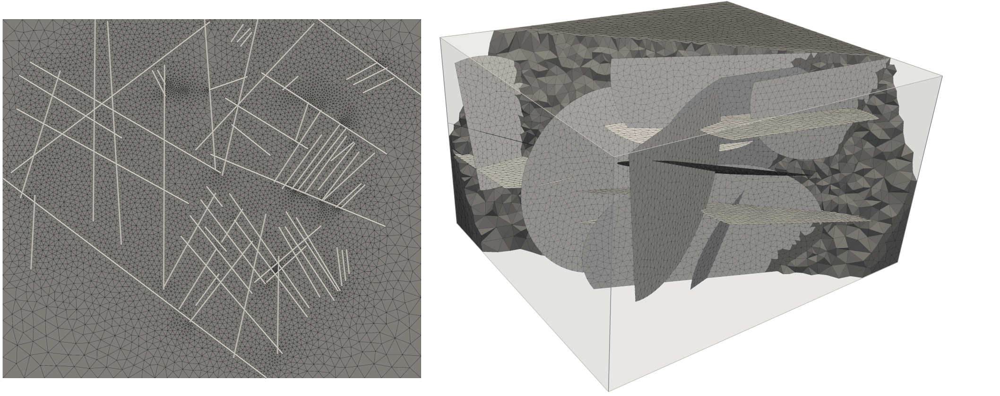
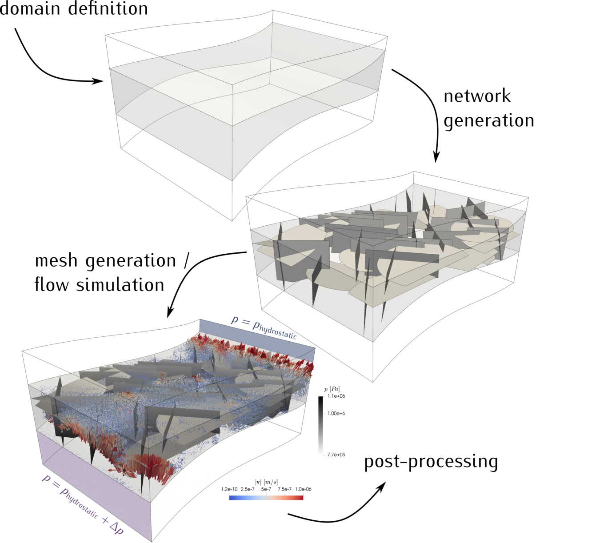

# Summary

The numerical simulation of flow and transport phenomena in fractured porous media
is an active active field of research, given the importance of fractures in many
geotechnical engineering applications, as for example groundwater management
[Qian et al., 2014], enhanced oil recovery techniques [Torabi et al., 2012],
geothermal energy [McFarland and Murphy, 1976, Shaik et al., 2011] or unconventional
natural gas production [Sovacool, 2014]. Numerous mathematical models and numerical
schemes aiming at an accurate description of flow through fracture rock have been
presented recently
`[@ahmed2015; @ahmed2017; @brenner2018; @koppel2019; @schadle2019; @nordbotten2019]`. Many of these describe the fractures as lower-dimensional
geometries, i.e. as curves or planes embedded in two- or three-dimensional
space, respectively. On those, integrated balance equations are solved together
with transmission conditions describing the interaction with the surrounding medium.
Moreover, it is often required that the computational meshes used for the different
domains are conforming in the sense that the faces of the discretization used for
the bulk medium coincide with the discretization of the fractures (see image below).



Information on the in-situ locations of fractures is typically sparse and
difficult to determine. In response to this, a common approach is to study
the hydraulic properties of rock in function of the fracture network topology by means
of numerical simulations performed on stochastically generated fracture networks.
Such investigations have been presented, among others, in
`@Kazumasa2003; @Assteerawatt2008; @lee2015fracture; @zhang2015finite; @lee2019stochastic`.
An open-source Matlab code for the stochastic generation and analysis fracture
networks in two- and three-dimensional space has been presented in `[@alghalandis2017]`.
However, the code is limited to linear (polygonal) fracture geometries, embedded
in hexahedral domains.

``Frackit`` is a C++-framework for the stochastic generation of fracture networks
composed of polygonal and/or elliptical geometries, embedded in arbitrary domain
shapes. It makes extensive use of the open-source Computed-Aided-Design (CAD)
library [OpenCascade][4], which offers great flexibility with respect to the
geometries that can be used. Moreover, a large number of standard CAD file formats
is supported for input/output of geometrical shapes. This allows users of ``Frackit``
to read in externally generated domain shapes
(for instance, from measurements and/or created using CAD software),
and to generate fracture networks within these domains. Output routines to standard
file formats enable users to then construct computational meshes of the generated
geometries using a variety of tools. In particular, ``Frackit`` offers
output routines to the (.geo) file format used by [Gmsh][2] `[@gmsh2009]`,
which is an open-source mesh generator that is widely used in academic
research (see e.g. `@keilegavlen2017; @berge2019;`).

The geometric data produced by ``Frackit`` contains the complete fragmentation
of all geometric entities involved, i.e. the intersection geometries between
all entities, and if desired with the domain, are computed. Thus, this information
can directly be used in the context of discrete fracture-matrix (dfm) simulations in
a conforming way as described above. For instance, the open-source simulator
[DuMuX][3] `[@Dumux; @koch2019dumux31]`contains a module for conforming dfm simulations of single- and multi-phase
flow through fractured porous media, which has been used in several works
`[@glaeser2017, @glaeser2019; @andrianov2019;]`.
It  supports the [Gmsh][2] file format (.msh), and thus, ``Frackit`` can be used in
a fully open-source toolchain with [Gmsh][2] and [DuMuX][3] to generate random
fracture networks, construct computational meshes, and perform analyses on them
by means of numerical simulations.

The design of ``Frackit`` is such that there is no predefined program flow, but
instead, users should implement their own applications using the provided classes
and functions, which allows for full customization of each step of the network
generation. Besides this, in the case of available measurement data, one could
skip the network generation process and use ``Frackit`` to compute the fragmentation
of the measured data and to generate CAD files for subsequent meshing.

# Concept

The functionality provided in ``Frackit`` follows from a conceptual division of
the network generation into three basic steps:

* Random generation of raw fracture entities based on statistical parameters
* Evaluation of geometric constraints for a new entity candidate against
  previously generated entities
* Fragmentation of the generated raw entities and possibly an embedding domain

The last of the above-mentioned steps and the motivation for it has been discussed
earlier. In the following we want to discuss the other two steps in more detail.

## Random generation of raw fracture entities

In the network generation procedure, a domain is populated with fracture entities
that are generated following user-defined statistical properties regarding their
size, orientation and spatial distribution. In ``Frackit``, this process is termed
_geometry sampling_ and is realized in the code in _sampler_ classes. Currently,
there are two sampler classes available, which sample quadrilaterals and elliptical
disks in three-dimensional space. A sampler class of ``Frackit`` receives an instance
of a `PointSampler` implementation and a number of probability distribution functions
that define the size and orientation of the raw entities. For example, an instance
of the `QuadrilateralSampler` could be created by writing:

```cpp
// the dimension of the space
static constexpr int spaceDimension = 3;
// the type used for coordinates values
using ctype = double;

// define an axis-aligned box in which to sample the centers of quadrilaterals
using Domain = Frackit::Box<ctype>;
Domain domain(0.0, 0.0, 0.0,  // coordinates of the first corner of the box
              1.0, 1.0, 1.0); // coordinates of the last corner of the box

// let us uniformly sample points within this box
const auto pointSampler = Frackit::makeUniformPointSampler(domain);

// let us use uniform distributions for the quadrilateral parameters
using Distro = std::normal_distribution<ctype>;
using QuadSampler = Frackit::QuadrilateralSampler<spaceDimension>;

// instance of the quadrilateral sampler class
QuadSampler quadSampler(pointSampler,                             // point sampler that samples the center points of the quadrilaterals
                        Distro(toRadians(45.0), toRadians(5.0)),  // strike angle: mean value & standard deviation
                        Distro(toRadians(0.0), toRadians(5.0)),   // dip angle: mean value & standard deviation
                        Distro(0.5, 0.1),                         // edge length: mean value & standard deviation
                        0.05);                                    // threshold for minimum edge length
```

`PointSampler` classes are used to sample the spatial distribution of the geometries
inside a domain geometry, and in the above example we use a uniform distribution on
the unit cube. Inside a geometry sampler class, the geometries are then created
by sampling a random point from the point sampler, and constructing a geometry
around this point using the provided distributions for its size and orientation.
The `QuadrilateralSampler` class expects distributions for the strike angle,
dip angle, edge length and a threshold value for the minimum allowed edge length.


The above figure illustrates the strike and dip angles. Consider a quadrilateral
which lies in the plane spanned by the two basis vectors $\mathbf{b}_1$ and
$\mathbf{b}_2$. The latter lies in the $x$-$y$-plane and the strike angle is the
angle between the $y$-axis and $\mathbf{b}_2$. The dip angle describes the angle
between $\mathbf{b}_1$ and the $x$-$y$-plane. After instantion of a sampler class,
a new quadrilateral can be sampled using the `()` operator:

```cpp
auto quad = quadSampler();
```

## Evaluation of geometric constraints

While the domain is populated with the raw fracture entities, users have the
possibility to enforce geometric constraints between different entities in order
to guarantee topological features (e.g. fracture spacing). Besides this, constraints
can be used to avoid very small length scales that could cause problems during
mesh generation or could lead to ill-shaped elements.


The above image illustrates geometric settings that one may want to avoid by
defining geometric constraints. These have to be fulfilled by a new fracture
entity candidate against previously accepted entities. If any of these constraints
is violated, the candidate may be rejected and a new candidate is sampled.
The current implementation of the `EntityNetworkConstraints` class allows users
to define a minimum distance between two entities that do not intersect. If two
entities intersect, one can choose to enforce a minimum length of the intersection
curve, a minimum intersection angle and a minimum distance between the intersection
curve and the boundaries of the intersecting entities. The following code snippet
illustrates how to set up an instance of the `EntityNetworkConstraints` class:

```cpp
// the type used for coordinate values
using ctype = double;

// Instantiate constraints class. This leaves all constraints deactivated.
Frackit::EntityNetworkConstraints<ctype> constraints;

// Set values to activate constraints
constraints.setMinDistance(0.1);               // in meter
constraints.setMinIntersectingAngle(M_PI/4.0); // in radians
constraints.setMinIntersectionMagnitude(0.05); // in meter
constraints.setMinIntersectionDistance(0.05);  // in meter

// define tolerance value to be used for intersections
constraints.setIntersectionEpsilon(1e-6);
```

When using the default constructor of `EntityNetworkConstraints`, all constraints
are inactive, and when defining values for the different constraint types, these
get activated internally. Moreover, one can define the tolerance value that should
be used in the intersection algorithms between entities. If no tolerance is set,
a default tolerance is computed based on the size of the entities for which the
intersection is to be determined. For two quadrilaterals `quad1` and `quad2`, one
can then evaluate the defined constraints by writing

```cpp
bool fulfilled = constraints.evaluate(quad1, quad2);
```

The function `evaluate()` returns true if all constraints are fulfilled. One can
also check the fulfillment of the constraints of a new candidate against an entire
set of entities. Let `quad` be a new candidate for a quadrilateral, and
`quadSet` be a vector of quadrilaterals (`std::vector< Quadrilateral<ctype> >`),
then the command `constraints.evaluate(quadSet, quad)` returns true if `quad`
fulfills the constraints against all entities stored in `quadSet`.


# Example application

In this exemplary application we want to briefly outline what the workflow using
`Frackit` together with [Gmsh][2] and [DuMuX][3] could look like. The images are
taken from the `Frackit` documentation ([git.iws.uni-stuttgart.de/tools/frackit][0])
and the setup is, apart from small modifications, very similar to the one presented
in [example 3][1] provided in the `Frackit` repository. For further details on how
to set up such configurations we refer to the source code and the documentation of
that example in the repository.

Let us consider a domain consisting of three solid layers, which has been created
using [Gmsh][2] and which is shown in the figure below.


We want to generate a fracture network only in the center volume, which we obtain
after reading in the geometry:

```cpp
/////////////////////////////////////////////////////
// 1. Read in the domain geometry from .brep file. //
//    The file name is defined in CMakeLists.txt   //
/////////////////////////////////////////////////////
const auto domainShape = Frackit::OCCUtilities::readShape(BREPFILE);

// obtain the three solids contained in the file
const auto solids = Frackit::OCCUtilities::getSolids(domainShape);

// The sub-domain we want to create a network in is the center one.
const auto& networkDomain = solids[1];

// get the bounding box of the domain
const auto bBox = Frackit::OCCUtilities::getBoundingBox(networkDomain);
```

The last command constructs the bounding box of the center volume of our domain,
which we can then use to instantiate point sampler classes with which we define
the spatial distribution of the fracture entities. With these, we can construct
geometry samplers as it was discussed earlier. In this example we define three
geometry sampler instances to sample from three different orientations of fractures,
and we use quadrilaterals for two of the orientations and elliptical disks for
the third orientation. Moreover, we define different constraints that should be
fulfilled between the entities of different sets. As mentioned above, details on
how to implement this can be found in [example 3][1] in the `Frackit` repository.

We then generate a number of fractures of each orientation, confine the result to
the center volume of the domain, fragment all geometries and write it into [Gmsh][2]
file format. After meshing the result with [Gmsh][2], a single-phase simulation
is carried out using [DuMuX][3]. The image below depicts the obtained fracture network,
as well as the pressure distribution on the fractures and the velocities in the
domain as computed with [DuMuX][3] using the illustrated boundary conditions.




# Citations

Citations to entries in paper.bib should be in
[rMarkdown](http://rmarkdown.rstudio.com/authoring_bibliographies_and_citations.html)
format.

For a quick reference, the following citation commands can be used:
- `@author:2001`  ->  "Author et al. (2001)"
- `[@author:2001]` -> "(Author et al., 2001)"
- `[@author1:2001; @author2:2001]` -> "(Author1 et al., 2001; Author2 et al., 2002)"

# Acknowledgements

We acknowledge contributions from Brigitta Sipocz, Syrtis Major, and Semyeong
Oh, and support from Kathryn Johnston during the genesis of this project.

# References


[0]: https://git.iws.uni-stuttgart.de/tools/frackit
[1]: https://git.iws.uni-stuttgart.de/tools/frackit/tree/master/appl/example3
[2]: http://www.gmsh.info/
[3]: https://dumux.org/
[4]: https://www.opencascade.com/content/download-center
